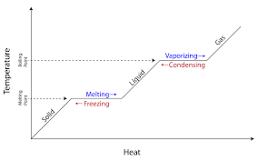

- ### Pre-Exam Notes
  id:: 61a38697-21e5-4b16-8e47-4be00deecaa7
	- ## Questions
		- 30 MC Questions
			- **Note** Practice without calculator
		- 2 Writing
			- 1 Long
				- 8 Small Questions
			- 2 Short
				- 4 Small questions
		- **Maybes**
			- _Q1_
				- 
				- **Why are phases constant?**
					- The temperature is fixed because the energy is used to separate the molecules apart.
				- **Which phase has higher** $$\delta H$$?
					- Liquid to gas, because it needs more energy to split compared to solid to liquid.
				- **Why is "for example" liquid state steeper than the solid state?**
					- Increasing in temperature is related to specific heat
					- if its more steep it require  less specific heat
					- its if less steep it require more specific heat
					- Liquid state is steeper than solid because it has a less specific heat
		- _Q2_
			- **How many ways to determine the** $$\delta H$$ **of reaction**
				- 3
					- Hess's Law
					- Direct Formula
					- Using **GIVEN** bond enthlapys
						- reactants - (products) = $$\delta H$$
		- _Q3_
			- **What is the Formal charge of NH4?**
				- Step 1:
					- Draw the lewis structure
				- Step 2:
					- Identify how many bonds each atom can make
				- Step 3:
					- Find the total valence electrons
				- Step 4:
					- Assign the central atom
				- Step 5:
					- Link all the atoms together and add the remaining atoms as a pair of electrons.
				- Step 6:
					- Check the stability.
		- _Q4_
			- **Polarity**
				- H-F
				- N-F
				- O-F
					- **Which is more polar?**
						- Using electronegativity
						- Or because they are far apart in  the periodic table
						- in this case it is H-F
	- ## Pages
		- 23 Pages
			- 6 Pages References
			- 17 Pages Solving