- 1)
	- 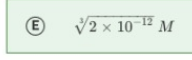
	- Ag2CrO4 -> 2Ag^+ + CrO_4^2-
	- Cubic$$\sqrt{\frac{Ksp}{4}}$$
	-
	-
- 2)
	- 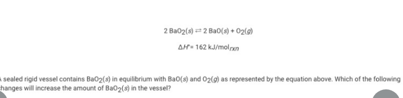
		- Lower temperature
		- ->
		- <-
- 3)
	- 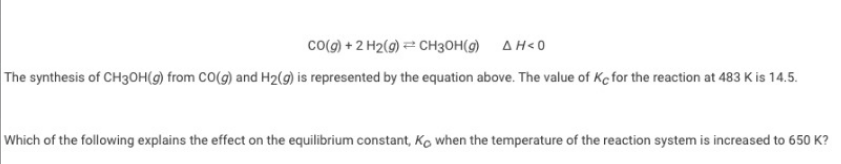
		- K_c will decrease because the reaction is exothermic
		- Releases
- 4)
	- 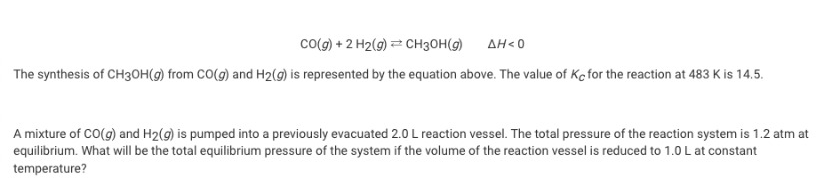
		- Greater than 1.2 atm but less than 2.4 atm
		- Pressure increased, moves forward.
- 5)
	- 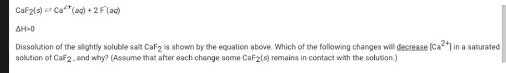
		- Adding NaF because reaction will proceed towards reactant
- 6)
	- 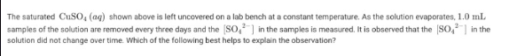
		- As water evaporates more CuSo4 preciptates
- 7)
	- 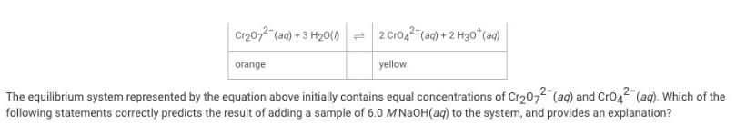
		- The mixture will become more yellow because OH^- toward product
- 8)
	- 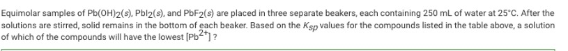
		- Pb(OH)2
- 9)
	- 
		- Increasing the temperature and decreasing the pressure by increasing the volume
- 10)
	- 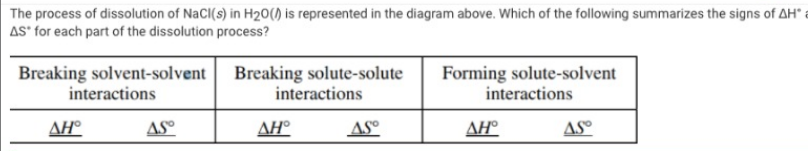
		- + + + + - -
- 11)
	- 
		- The autoionization is larger
- 12)
	- 
		- 11-12
- 13)
	- 
		- 12
- 14)
	- 
		- Between 2 and 3
- 15)
	- 
		- NH4+
- 16)
	- 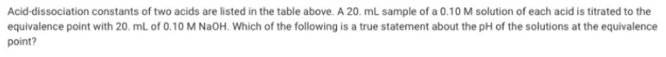
		- conjugate base
- 17)
	- 
		- 5.0 x 10^-6
- 18)
	- 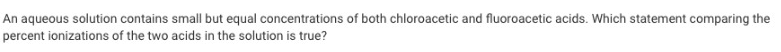
		- Percent ionization of chloroacetic acid is less than
- 19)
	- 
		- CIO_2-
- 20)
	- 
		- 0.1 M NH_3
-
-
- 21)
	- a.
		- ag^+ = cl^-
		- ksp = [ag^+][cl^-]
		- 1.8 x 10^-10 = s*s
		- 1.8 x 10^-10 = s^2
		- solve for s
		- Ag^+ = 1.3 x 10^-5
	- b.
		-
			- 1.8 x 10^-10 / 0.54 = Ag^+
			- = 3.3 x 10^-10
		- ii. AgCl is less soluble due to the common ion effect
- 22)
	- a.
		- 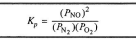
	- b.
		- 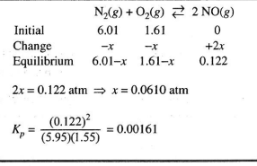{:height 193, :width 286}
		- 1.61  x 10^-3
	- c.
		- i.
			- 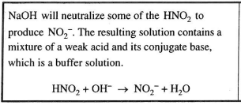
			- In order to produce NO2, NaOH will neutralize some of the HNO2, resulting in a solution containing a mixture of weak acid and its conjugate base.
		- ii.
			- 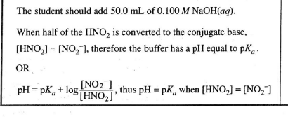
			- an addition of 50 mL and 0.100 M of NaOH
			- bufer pKa equal to ph
- 23)
	- 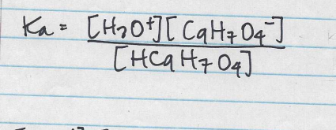
	- b.
		- 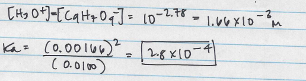
	- c.
		- 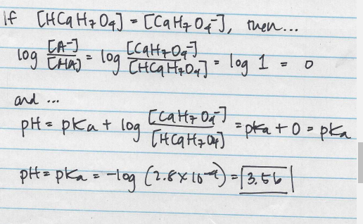
	-
-
- K_a = $$C_9H_7O_4 + H_3O / HC_9H_7_O4$$
- 10^-2.78 = 0.001659
-
  $$\frac{0.001659^2}{0.0100} = 0.000275$$
- HC9H7O$4 = C9H7O4^-
-
- log(1) =
- pH = pka + 0
- pH = pka = -log(0.000275)
-
-
-
- Kp  = (PNO)^2 / Pn_2 + Po_2
- 2s = 0.122, s =
- Kp = (0.122)^2 / (6.01 - s) (1.61  -s)
- =
- C.
	- i in order to produce NO2 the NaOH will neutralize HNO2 resulting in a reaction that is weak acd and conjugate base a buffer reaction
	- HNO2 + OH^- -> NO2^_ + H2O
	- /0.100
-