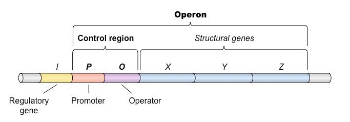

title:: 13.1-prokaryotic_regulation

- ## Objectives
	- To understand prokaryotic regulation
- ## Learning Methodologies
	- AP Collegeboard
	- Mcgraw
	- Padlet
	-
- ## Understanding
	- Social status can affect gene expression
	- Bacteria does not require the same enzymes all the time
	- Enzymes are produced as needed
	- ### Operons
		- An operon is a group of structural and regulatory genes that function as a single unit
		- Francois Jacob and Jacques Monod in 196 proposed the operon model to explain the regulation of gene expression in prokaryotes
		- 
			- Regulatory Genes
				- Long segments of DNA
			- Promoters
				- a nucleotide sequence that enables gene transcription RNA polymerase recognizes the promoter and initiates transcription.
				- Short segments of DNA
			- Operator
				- a DNA segment to which a repressor binds A link between the promoter and the operon's genes.
				- Short segments of DNA
			- Structural Genes
				- Long segments of DNA
	- ### Reflection
		- **Concepts I have learned today**
			- I learned about prokaryotic regulation
		- **Concepts I still have questions about**
			- Nothing
		- **Concepts I did not understand**
			- Nothing