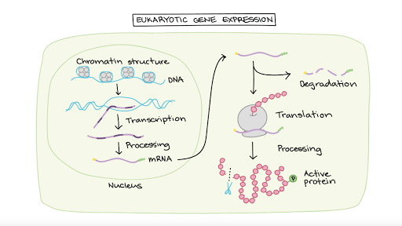
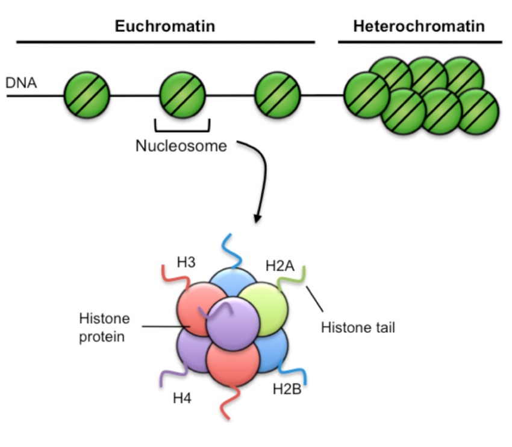

title:: 13.2-eukaryotic_regulation

- ## Objectives
	- To understand eukaryotic regulation
## Learning Methodologies
	- AP Collegeboard
	- Mcgraw
	- Padlet
- ## Understanding
	- 
	- ### Primary levels of mechanism
		- Nuclear Level
			- Chromatin Structure
			- Transcription Control
		- Cytoplasmic Level
			- Translation Control
			- Port
	- ### Chromatin Structure
		- Eukaryotic DNA is associated with histone protein
		- Together they make chromatin
		- 
	- ### Reflection
		- **Concepts I have learned today**
			- I learned about eukaryotic regulation
		- **Concepts I still have questions about**
			- Nothing
		- **Concepts I did not understand**
			- Nothing