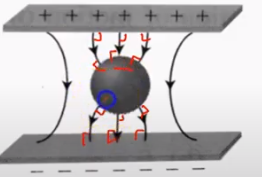

title:: 2.1

- ## Understanding
- ### Electrostatic Equilibrium
	- A state where excess charge on an isolated conduct will spread on the surface of the conductor until there is no more movement of this charge.
		- **Excess Charge**
			- Will reside on the outer surface of the conductor (Qnet \neq 0)
			- Will move as far apart as possible until the system reaches an Equilibrium
				- **Justification** At the point of equilibrium all charges would have formed a uniform distribution on the outersurface of the sphere
			- A sphere behaves as if all its excess charges  were concentrated at its center
		- **Electric field**  ($$E = k\frac{Q}{r^2}$$ outside the conductor)
			- Inside conductor ($$E_{f\text{inside}} = 0$$) is zero
				- **Justification** If it was otherwise, the electrons would accelerate and the object won't be in equilibrium
					- Due to the lack of an excess charge nothing will serve as a source for an electric field line in the sphere
					- $$E_f$$ lines begin and end on excess charges
			- The electric field just outside the surface of the conductor is perpendicular to the surface (90\deg)
				- **Justification** If it wasn't perpendicular, there would a force enacted on the free electrons resulting in their acceleration
			- #### The change imposed by external electric fields
				- An external electric field will induce charges in the conductive walls to separate
				- The charges of course, align themselves on the outer walls of the object  opposing the electric field that caused the induction
				- Resulting in a region of zero electric field
			- #### Irregularly Shaped Conductors
				- $$E_f$$ is not the the same at all points on the surface
				- It is greatest at the places where the object has smallest radius curves, sharp corners of points.
		- **Electric Potential**
			- Constant inside the conductor and is equal to the potential on the surface of the conductor
				- **Justification** Electrons will move to a higher potential cancelling the change in potential
					- If there is no electric field pushing a charge inside then there won't be any work done
						- $$V = \frac{W}{Q}$$
						- making electric potential on the surface equal everywhere
				- _**Equations**_
					- Potential difference for a point charge or spherically symmetric charge (sphere not irregular shape)
					- $$V = k\frac{Q}{r}$$
						-
						- **Note**: Inside conductor it is a not r
					- Charged sphere is
						- $$V = \frac{Q}{4\pi \epsilon R}$$
					- If potential energy is known then it is
						- $$\delta V = \frac{\delta U}{q}$$
					- Potential difference between two points in an electric field
						- $$\delta V = -\int^b_a E^\rightarrow \times dr^\rightarrow$$
					-
			- A conductor is an equipotential surface
			- When isolated conductors are joined by a wire, the charges redistribute until they both have same potential (Only Potential electric field etc not necessarily)
- #### Remember
	- Conductors are materials that have many **free** electrons
	- Surface Charge Density is $$\frac{\text{Total Charge}}{\text{Surface Area}}$$
- ### Electric Ground
	- An electric ground is an \infty source and a \infty sink for electrons
		- If a negatively charged object is grounded electrons will leave the object until charge is neutral (zero)
		- If a positively charged object is grounded electrons will enter the object until the charge is neutral (zero)
- ## Applying
	- ### Albert.io
		- **Q ~ 1 :** https://www.albert.io/learn/ap-physics-c-e-and-m/21-conductors-capacitors-dielectrics-electrostatics-with-conductors/electric-field-inside-conductor-charge-density-on-conductor
			- **Note**
				- Charge density is the measure of electric charge per unit area of a surface, or per unit volume of a body or field
			- When +q charge is brought closer the -q charge will get included in the conducting sphere.
			- The initial sphere had +Q per unit area charge density on the surface, when -q came the charge density on the surface will reduced causing the charge density at P to decrease
			- Electric field will remain zero as ($$E_{f\text{inside}} = 0$$)
		- **Q ~ 2 :** https://www.albert.io/learn/ap-physics-c-e-and-m/21-conductors-capacitors-dielectrics-electrostatics-with-conductors/conducting-spheres-contact-different-radii-electron-flow
			- **Note**
				- Net charge is protons - electrons
			- By bringing a charged object into contact with an uncharged object, some electrons will migrate to even out the charge on both objects.
			- So, in this case the one with a positive net charge's electrons will flow into the uncharged one, to result in (Qnet = 0)
		- **Q ~ 3 :**  https://www.albert.io/learn/ap-physics-c-e-and-m/21-conductors-capacitors-dielectrics-electrostatics-with-conductors/conductor-in-a-field
			- Inside a conducting sphere Electric field is always zero
			- 
		-
- ## Reflections on my Understanding
	- _Concepts I have learned by the end of the lesson_
		- I learned about Electric Ground & Electrostatic equilibrium
	- _Concepts I still have questions about_
		- Nothing
	- _Concepts I did not understand_
		- Nothing