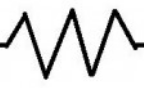
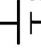
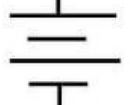

title:: 3.2

- ## Understanding
	- **P** Energy and Power
	- ### Energy and Power
		- Refers to P = $$\frac{I}{V}$$
			- $$P = I^2R$$
			- and also $$P = \frac{V^2}{R}$
		- Resistors become  hot when  current passes through them; the  thermalenergy generated is called joule heat
	- ### Circuit analysis
		- 
			- Resistors
		- Battery could be represented by
			- 
			- or
			- 
			- The direction at which the current flows out of the battery is of which the larger | is located so if the larger | was on the left it would go counter clockwise and etc
				- If we had two batteries and we were asked for the direction we take the larger one
	- ### Resistors in Circuits
		- #### In Parallel
			- - $$\frac{1}{R_{equiv}}$$ could be found through $$\\sum_i \frac{1}{R_i}$$
		- #### In Series
			- -$$R_{equiv}$$ could be found through $\sum_i R_i$$
- A battery is ideal if it has negligible internal resistance
- More length higher resistivity
- ## Reflections on my Understanding
	- _Concepts I have learned by the end of the lesson_
		- I learned about resistors in circuits
	- _Concepts I still have questions about_
		- Nothing
	- _Concepts I did not understand_
		- Nothing