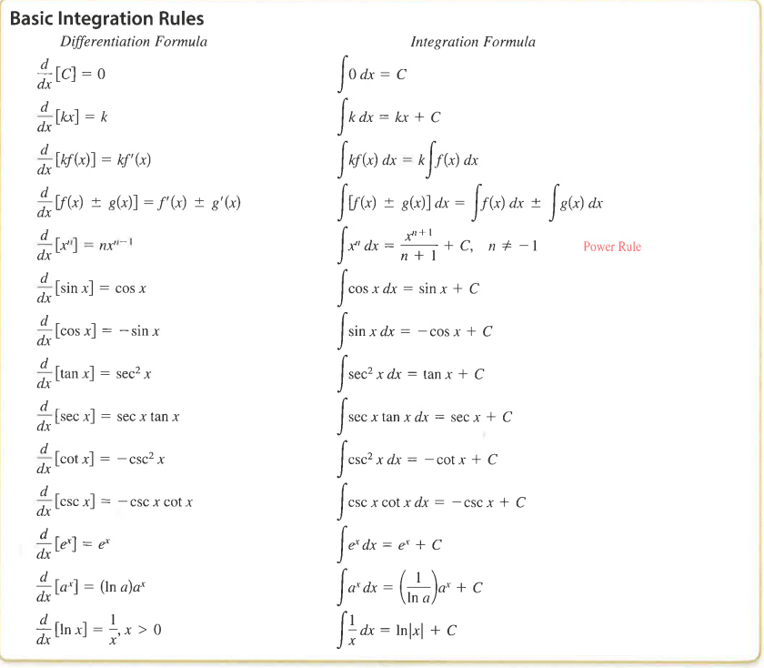

title:: 4.1: Antiderivatives and Indefinite Integration

- ## Understand
	- Integration
		- 
- ### Exercises
	- ~~14, 20, 24, 25, 30, 40~~, 69, 70, 71
		- 14) $$\int{(\sqrt{x} + \frac{1}{2\sqrt{x}})}dx$$
			-
			  $$x^{1/2} + \frac{x^{-1/2}}{2}$$
			-
			  $$\frac{x^{3/2}}{3/2} + x^{1/2} + C$$
			- OR
			-
			  $$\frac{2}{3} \sqrt{x^{3}} + \sqrt{x} + C$$
		- 20) $$\int{\frac{x^4 - 3x^2 + 5}{x^4}}dx$$
			-
			  $$\frac{x^4}{x^4} - \frac{3x^2}{x^4} + \frac{5}{x^4}$$
			-
			  $$1x + \frac{3}{x} - \frac{5}{3x^3} +c  $$
		- 24) $$\int{\theta^2 + sec^2\theta}$$
			-
			  $$\frac{\theta^3}{3} + \tan\theta + C$$
		- 25) $$\int{2sinx-5e^x}$$
			-
			  $$-2cosx -5e^x + C$$
		- 30)$$ \int{cosx + 3^x}$$
			-
			  $$sinx+\frac{1}{ln3}3^x + C$$
		- 40) $$f''(x) = x^2, f'(0)= 8, f(0) = 4$$
			- x^3/3 + C = 8
			- x^4/12 + 8x + C =4
			-
			  $$x^4/12 + 8x + 4$$
		- 69)$$\int{\sqrt{x}(10x-3)dx}$$
			-
			  $$4x^{5/2} - 2x^{3/2} + C$$
		- 70)
-
-
  $$\int{5e^{-\sqrt{x}}}$$
-
  $$5e^{-\sqrt{10}} + C = 2e$$
- C = 5.2249
-
  $$5e^{-\sqrt{2}} + 5.2249$$
-
- x^3 / x^2 + 2
- x / 2 + sin x / x^2 + 2
- x^2/4+ -cosx/x^2 + 2
-