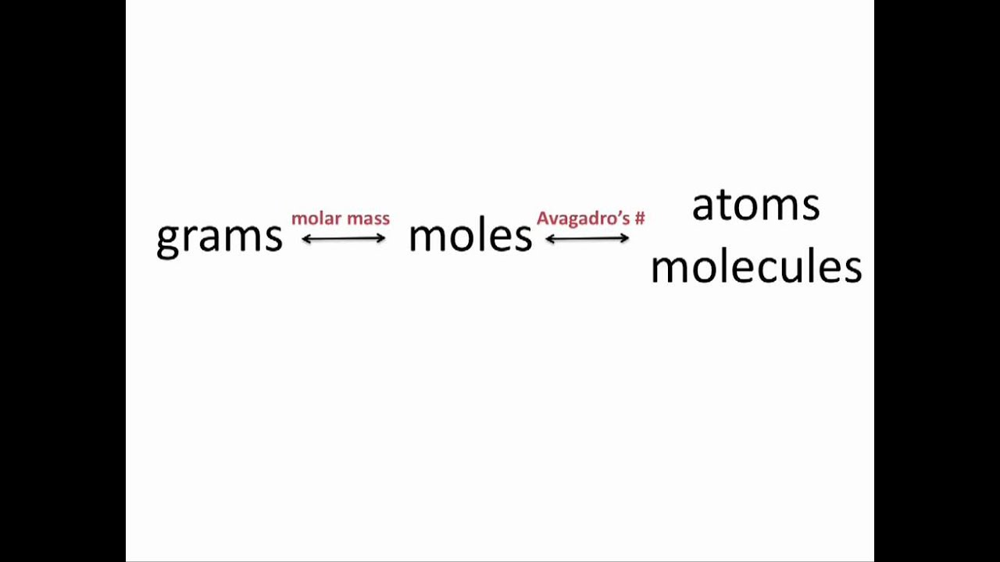

title:: 7.8_representations-of-equilibrium

- ### Objectives
	- Identify the concentrations or partial pressures of chemical species at equilibrium based on the initial conditions and the equilibrium constant
	- Explain the relationships between Q, K, and the direction in which a reversible reaction will proceed to reach equilibrium.
- ### Remember
	- 
	- 6.02 x 10 ^23
- ### Understanding
	- **Equilibrium Constant Expression**
		-
		  $$K = \frac{\text{Products}}{\text{Reactants}}$$
			- Coefficient is added as power
		- Q = K => At equilibrium
		- Q > K => More product
			- Consume product and form reactant to reach equilibrium
			- moves right (forward)
		- Q < K => More reactant
			- Consume reactant and form products to reach equilibrium
			- moves left (backwards)
	- **Determining Molarity**
		- To determine the molarity of an element simply
			-
			  $$\text{Molarity} = \frac{moles}{liters}$$
	- Dynamic equilibrium is reached when rate rate forward = rate reverse
		- All reactant and product concentrations are constant at equilibrium
	- K is also referred to $$K_c$$ and $$K_{eq}$$
	- For reactions not at equilibrium we can write a similar expression called reaction quotient Q which is equal to K at equilibrium
	- ~ $$K_c$$ and Q can be used to find if a reaction is at equilibrium, and to estimate so
- ### Solving