- قصيدة مدح وحماسه
- سيف الدوله
- المتنبي
- معركه الحدث
- المسلمين ضد الروم
	- بقياده الدمستق
	- قلعة الحدث
- هدف سيف الدوله
	- اعاده اعمار وبناء القلعه
- لماذا اطلق على  المعركه الحدث الحمراء
	- لكثر الدماء التي اريقت فيها
-
- **مفرادات**
	- **العزم**
		- العزيمه
		- Determination
		- الهمة
	- **الحدث**
		- قلعه اعاد بناءها سيف الدوله في الروم وقوله حمراء الانها احمرت بدماء الروم
	- **القنا**
		- الرماح
	- **متلاطم**
		- يضرب بعضه بعضا
	- **برقوا**
		- لمعوا
	- **لسن**
		- اللغه
	- **الحداث**
		- المتحدثون
	- **الردى**
		- الموت
	- **وضاح**
		- مشرق
	- **ثغرك**
		- فمك
	- **الخوافي**
		- ما تخت القوادم
	- **القوادم**
		- ريشات بجناح الطاءر يعتمج عليها في الطيران
	- **الهامات**
		- جمع هامه
		- الراس
	- **اللبات**
		- النحور
		- الرقاب
		- اعلى الصدر
	- **لتعدو**
		- تجري مسرعا
	- **سروا**
		- سارو ليلا
		- سري
	- **كلمى**
		- جمع كليم
		- جريج
	- زحمه
		- تقدمه
	- الزمازم
		- جمع زمزمه
		- الاصوات التي لا تفهم لتداخلها
	- **الفاض العسكريه**
		- **خميس**
			- جيش عظيم
		- **الوغى**
			- الحرب
		- **البيض**
			- السيوف
		- **الصوارم**
			- صارم
			- القوي
	- **حقل الطبيعه**
		- **الغماءم**
			- غيمه
			- غمامه
		- **الغر**
			- الاغزر ماء
		- **سقتها**
		- **موج**
		- **الاحيدب**
			- موضع
			- اسم الجبل الي عليه الحدث
	- **الخوافي**
		- خافيه
	- الجوزاء
		- برج سماوي
-
- **البلاغه وصور البيانية**
	- **البيت الاول**
		- التصريع
		- العزاءم المكارم
		- محسن بدعي
		- 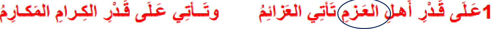
	- **البيت الثاني**
		- المقابله
		- بين الشطر الاول والثاني
		- محسن بدعي
		- 
	- **البيت الثالث**
		- الحدث الحمراء
		- كنايه عن كثره القتلى في صفوف الجماجم
		- 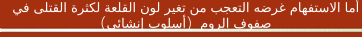
		- 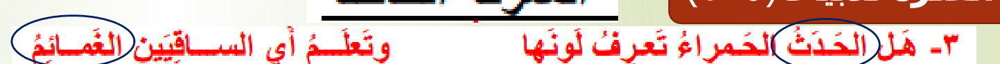
	- **البيت الرابع**
		- استعاره مكنية سقتها الغمام اي الحمام
		- 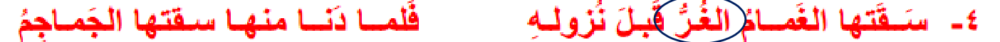
	- **البيت الخامس**
		- استعاره مكنية
		- 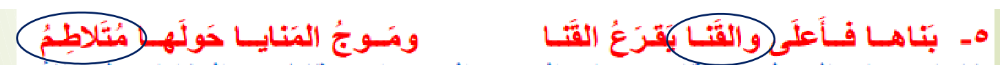
	- **البيت 6-7**
		- كنايه عن كثرة تحصنهم وعنادهم
		- 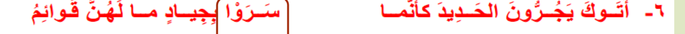
		- 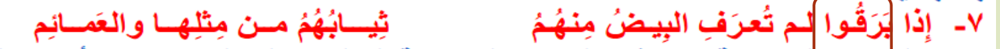
	- **البيت الثامن**
		- استعاره مكنيه
		- 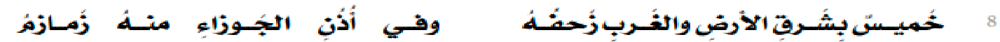
	- **البيت العاشر**
		- استعاره مكنيه
		- 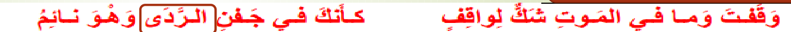
	- **البيت الثاني عشر**
		- اشتعاره تصريحيه
		- 
	- **البيت الثالث عشر**
		- طباق
		- 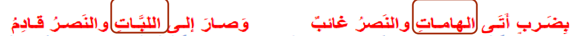
	- **البيت الرابع عشر**
		- استعاره مكنيه
		- 
	- **البيت الخامس عشر**
		- تشبيه تمثيلي
		- 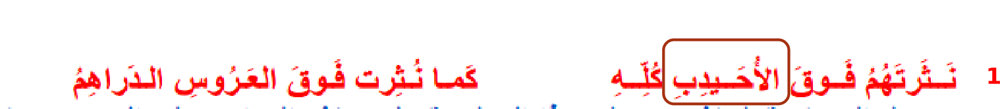
	- **البيت السادس عشر**
		- طباق
		- 
	- **البيت السابع عشر**
		- استعاره تصريحيه
		- 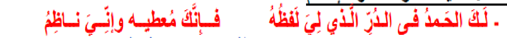
-
-
- ### From Previous Exam
	- 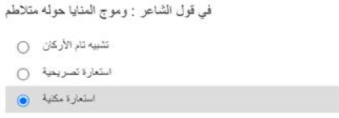
	- 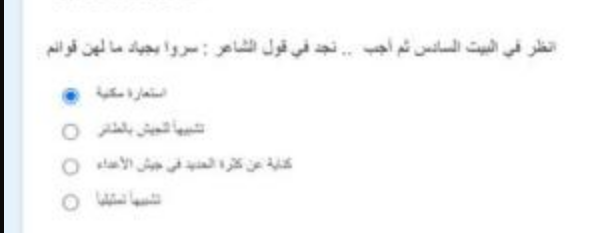
		-
	- 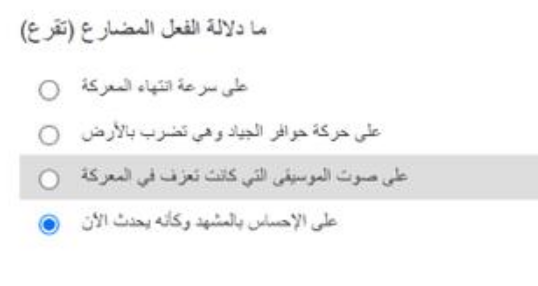
	- 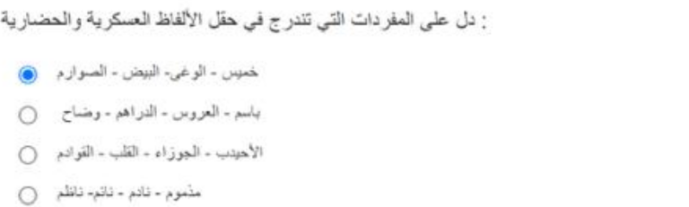
	- 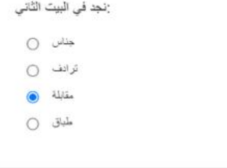
- سوال يسال حط الكلمه في جمله
-