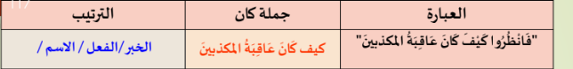

## كان واخواتها
	- ### اخواتها
		- اصبح
		- اضحى
		- امسى
		- بات
		- صار
		- ظل
		- ليس
		- ما زال
		- ما دام
	- ### اقعال
		- ناقصه
			- فاعلها
			- المفعول بها
		- ناسخه
			- المبتدا يتغير
				- الى اسم كان
					- Not necessarily كان may be sister
				- يبقى مرفعوع
			- الخبر ييتغير
				- الى خبر كان
					- Not necessarily كان may be sister
				- يصبح منصوب
			- _Examples_
				- الطالب مجتهد
					- اصلهاstudent123
						- المبتدا
							- مبتدا مرفوع
						- خبر
							- خبر مرفوع
					- Add كان
						- المبتدا
							- مبتدا كان مرفوع
						- خبر
							- خبر كان منصوب
		- متصرفه
	- 
	- 
	-
	- #+BEGIN_NOTE
	  اول ماتجوف كان او اخواتها هي جمله اسميه
	  #+END_NOTE