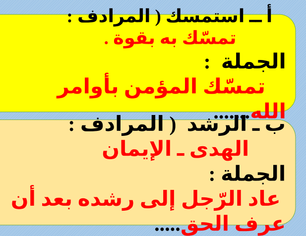
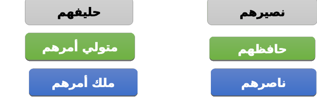
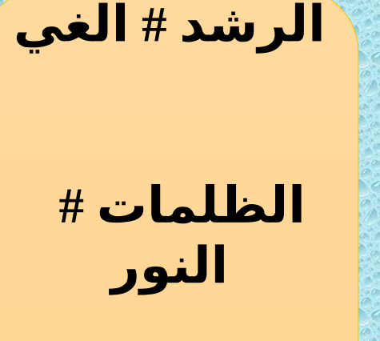
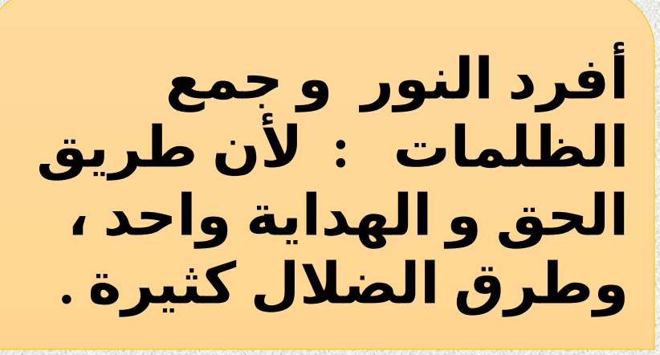
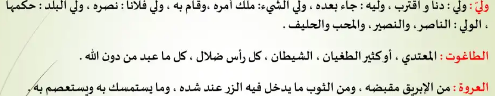
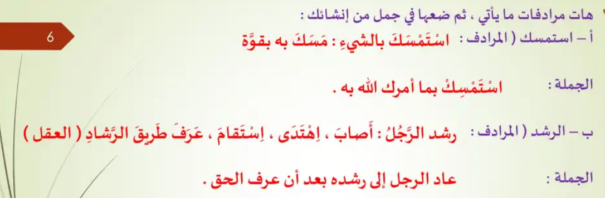

title:: permanent-notes/arabic

## Mid-Term 2 Arabic
	- ### الدروس
		- جملة كان وأخواتها
			- [[permanent-notes/arabic/kana-wa]]
		- المفعول المطلق
			- [[permanent-notes/arabic/maf3ool-mtlag]]
		- قصيدة على قدر أهل العزم
			- [[permanent-notes/arabic/3la-gdr-ahl]]
		- الله ولي الذين آمنوا
			- 
			- 
			- 
			- 
		- 
		- 
		- 
	-
	-
	- ## Mid Term (T2) 1
		- **الدروس**
			- [[الحديث]]
			- [[نثر الجو]]
			- [[كاد واخواتها]]
-