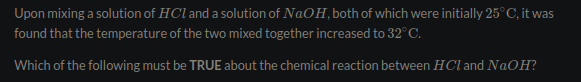

title:: permanent-notes/chemistry/6.1

- Enthalpy is heat(q) exchanged at constant pressure
### Energy Law
	- It takes energy to break bonds and attractive forces
		- The process is unfavorable and is positive
	- It frees energy to form bonds and attractive forces
		- The process is favorable and is negative
- Chemical Change
	- Combustion
		- Endo < Exo,  forming bonds energy released is greater, favorable and is negative.
- Physical Change
	- Liquid to gas => Breaking the hydrogen bond leading to absorb in energy +, unfavorable & less stable
	- Gas to liquid => Forming new bonds leading to release of energy, more stable, -, and favorable
- Ambigious
	- Physical
		- The salt can be retrteved by simple evaporation
		- Evaporation is a physical process in which water is vaporized
	- Chemical
		- DIssolving is often accompanied by change in temperature
		- Ionic bonds are being broken which requires energy absorb
### Systems
	- _What is it?_
		- The part of the universe we are studying
	- TTB $$>$$ FTF $$ = +\delta H$$
		- Endothermic
	- TTB $$<$$ FTF = $$-\delta H$$
		- Exothermic
### Surroundings
	- Energy released by system goes to surrounding
	- Energy required by system goes to surrounding
	- ### Exothermic Flow
		- _Can be either one of the following_
			- Releases heats into surrounding
			- OR work done by system
				- It is given a negative sign, $$w = -P\delta V$$
				- Expansion
	- ### Endothermic Flow
		- Can be either one of the following
			- Heat flow from surrounding
			- Or work is done ON the system (+) by surrounding
				- Compression
	- Everything that is external to the system is the surrounding
		- _Examples_
			- Any solutes in the solution => Surrounding
			- Hand
			- Beaker
	- #+BEGIN_NOTE
	  WHEN WE MEASURE TEMPERATURE CHANGES DURING A CHEMICAL REACTION THIS IS SURROUNDING NOT SYSTEM
	  #+END_NOTE
### First law of thermodynamics
	-
	  $$\delta U  = q + w$$
	- Where
		-
		  $$q = \delta H$$
		-
		  $$\delta w = -P \delta V$$
	-
	  $$\delta U = \delta H - P \delta V$$
	-
	  $$\delta H = \delta U + P \delta V$$
	- _Note_
		- Work is 0 if no work is done in expansion, (P = 0)
		- ~ $$\delta V$$ = (Final v - Initial v)
		-
	-
### Applying
	- _In terms of solution chemistry and solvation, which of the following is exothermic?_
		- Formation of solute-solvent interactions
			- According to FTF
	- _Why does the solution feel warm when a small amount of water is added to solid copper(II) sulfate anhydrous to make a solution?_
		- Bonding occurs between solute and solvent, releasing energy
			- According to FTF
	- _Which  of the following processes is endothermic?_
		- Ice melting
	- 
		- Releasing to solution
		- Exothermic
	- _Which of the following process can be described as endothermic_
		- Melting from solid to liquid
		- _**Case Note:**_ S->G are endothermic because they need energy to break bonds, G->S are exothermic because they form bonds so they release energy
	- _Which of the following is  true about the chemical energy stored within the products compared to the reactants?_
		- In endothermic, the product has more energy than the chemical energy in reactants and vice-versa
		- In exothermic, the product has less energy than the chemical energy in reactants and vice-versa.