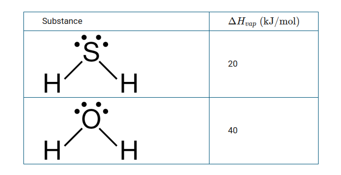
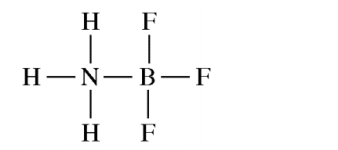

title:: permanent-notes/chemistry

- ## Mid Term
	- [[7.8_representations-of-equilibrium]]
	- [[7.9_introduction-to-le-chatelier]]
	- [[7.10_reaction-quotient-and-le-chatelier]]
	- [[7.11_introduction-to-solubility-equilibria]]
	- [[7.12_common-ionc-effect]]
	- [[7.13_ph-and-solubility]]
	- [[7.14_free-energy-of-dissolution]]
	- [[8.1_introduction-to-acids-and-bases]]
	- [[8.2_ph-and-ph-of-strong-acids-and-bases]]
	- [[8.3_weak-acids-and-base-equilibria]]
	- [[8.4_acis-base-reactions-and-buffers]]
	-
- ## Final Exam
	- {{embed ((61a38697-21e5-4b16-8e47-4be00deecaa7))}}
	- ### Lessons
		- [[permanent-notes/chemistry/3.12]]
		- [[permanent-notes/chemistry/6.1]]
		- [[permanent-notes/chemistry/6.2-6.3]]
		- [[permanent-notes/chemistry/6.4]]
		- [[permanent-notes/chemistry/6.5]]
		- [[permanent-notes/chemistry/6.6-6.7-6.8-6.9]]
	- ### Known Questions - FRQ
		- Question 1
			- ### Part (1)
				- (a) _A student wants to design a heating pad that could heat a 150.0 g sample of water from 25 deg to 60 deg_
					- (i) _Calculate, the amount of heat, in joules, that the water must absorb for its temperate change by this amount._
						- q = $$m \delta T$$
						- = 150 $$\times 4.18 \times (60 - 25)$$
						- 2.19 $$\times 10^4 J$$
					- (ii) _Calculate the minimum mass of CaO(s) that the student would need to use in order to cause this temperature change_
						- $$(2.19 \times 10^4 J) \times \frac{1 mol}{6.37 \times 10^4 J} \times \frac{1 mol CaO}{1 mol} \times \frac{56.1 g CaO}{1 mol CaO} = 19.3 g$$
			- ### Part (2)
				- (a) _Explain why the diagram on the left is the better representation for the bonding in fulminic acid. Justify your choice based on formal charges. Fulminic acid can convert to isocyanic_
					- Because it puts a negative formal charge on oxygen which is more electro negative than carbon
				- (b) Using the lewis electron-dot diagrams, determine the value of $$\delta H$$ for the reaction of HCNO to form HNCO
					- (413 + 891 + 201 = 1505), (391 + 615 + 745 = 1751)
					- $$\delta H = 1505 - 1751 \\ 
					  = -246 kJ/mol_{rxn}$$
		- Question 2
			- 1  _A student claims that 2 VbO_3 contains two Vb-O bonds of equal lengths and one Vb-O bond that is shorter than the other two. Do you agree or disagree_
				- i disagree all three Vb-O bonds should have same length because $$Vbo_3^{2-}$$ has three same resonance structures
			- 2 _The complete photoelectron spectrum of an element in its ground state is represented below_
				- (a) Based on spectrum
					- (i) write the ground-state electron configuration of the element
						- 1s^2 2s^2 2p^6 3s^2 3p^6 4s^2
					- (ii) identfy the element
						- its calcium
				- (b) Calculate wavelength in meters of electromagnetic radiation neded to remove an electron
					- E = hr
					- 0.98 x 10^-18 = 6.626 x 10^-34 J*s r
					- r = 1.48 x 10^15 sec
			- 3 _Wavelength of 510 nm corresponds to an approximate frequency_
				- 4 x 10^-19
			- 4 _Using wavelength information above what is the color of the light_
				- Orange
	- ### Known Questions - MCQ
		- _1) A 1.0 g sample of a cashew was burned in a calorimeter containing 1000_
			- C, combustion of 1.0 g of cashew releases more energy than the combustion of 1.0 g of marshmallow
		- _2) In an experiment a student mixes a 50.0 mL sample of 0.100 M AgNO3(aq) with a 50.0 mL sample of 0.100 M NaCl(aq) at 20.0°C in a coffee-cup calorimeter. Which of the following is the enthalpy change of the precipitation reaction represented above if the final temperature of the mixture is 21.0°C? (Assume that the total mass of the mixture is 100. g and that the specific heat capacity of the mixture is 4.2 J/(g °C)._
			- 84 kJ/mol
		- _5) Which of the following molecules has an angular (bent) geometry that is commonly represented as a resonance hybrid of two or more electron-dot structures?_
			- B, $$O_3$$
		- _6)_  H2S and H2O. _Approximetly how many moles of H2S must be condensed to release as mch heat as would be released when 1 mole of H2O is condensed?_
			- 2 Moles of H2S
			- Calculation
			- Lesson
		-
		- _11) A 10. g cube of copper at a temperature T1 is placed at a temperature T2  if T1 > T2, which of the following is true of the system when it has attained thermal equiblibirum?_
			- A, The temperature of the copper changed more than the temperature of the water
		- _12) NH3 reacts with BF3 to form a single species. Which of the following structural diagrams is the most likely representation of the product of the reaction?_
			- H    |   F |
			- H - N - B - F
			- H    |   F |
			- 
			- **Lesson**
			-
		- _17) A sample containing atoms of C and F was analyzed using x-ray photoelectron spectroscopy_
			- B, Peak X, because F has a greater nuclear charge than C has.
			- ### Lesson
				-
		- _20)_ The elements K and Cl react directly to form the compound KCl according to the equation above.
			- C, x + 2y
		- _22) Of the following single bonds, which is the LEAST polar?_
			- Less polar, means they're close in the periodic table
			- C, O-F
		- _23) The change in enthalpy for a reaction_ ($$\delta H$$) _= -760 kJ mol-1. Which of the following statements is true_
			- C, The energy liberated when bonds are made during the reaction is greater than the energy required to break bonds during the reaction.
		- _24) Which of the following molecules needs resonance structures to accurately describe its bonding_
			- A, SO2
			- ### Lesson
				- Bond Resonance
		- _29) List of the minimum amount of data needed for determining the molar enthalpy of solution of KCl_
			- C, Mass of KCL(s), mass of H2O, initial temperature of water, and final temperature of solution
			- ### Lesson
				- Bond enthalpy