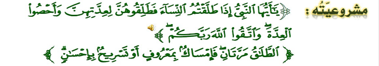

title:: permanent-notes/islamic/الفراق

- #card _اسس اختيار شريك العمر_
  card-last-interval:: 4
  card-repeats:: 1
  card-ease-factor:: 2.6
  card-next-schedule:: 2021-12-03T01:17:42.761Z
  card-last-reviewed:: 2021-11-29T01:17:42.761Z
  card-last-score:: 5
	- الدين
	- الخلق
	- التقارب في السن
	- الثقافة
- #card _وسائل تهيثة المقبلين على الزواج بما لهم من حقوق وما علهم من واجبات زوجية؟_
  card-last-interval:: 4
  card-repeats:: 1
  card-ease-factor:: 2.6
  card-next-schedule:: 2021-12-03T01:12:32.899Z
  card-last-reviewed:: 2021-11-29T01:12:32.900Z
  card-last-score:: 5
	- التوعيه من خلال الوالدين
	- اقامة دورات لعليمهم احكام الزواج
- #card _اوجه الخير في صبر الزوج على زوجته اذا كره منها خلقا مهينا_
  card-last-interval:: -1
  card-repeats:: 1
  card-ease-factor:: 2.5
  card-next-schedule:: 2021-11-29T20:00:00.000Z
  card-last-reviewed:: 2021-11-29T01:28:19.859Z
  card-last-score:: 1
	- تماسك الاسره
	- الاجر والثواب
	- تماسك المجتمع
	- عودة الزوجة الى رشدها
- #card _ماهو النشوز_
  card-last-interval:: -1
  card-repeats:: 1
  card-ease-factor:: 2.5
  card-next-schedule:: 2021-11-29T20:00:00.000Z
  card-last-reviewed:: 2021-11-29T01:20:46.957Z
  card-last-score:: 1
	- استعلاء
	- سوء عشرة احد الزوجين للاخر,
- #card  _ (والتي تخافون نشوزهن) علاج النشوز الزوجه_
  card-last-interval:: -1
  card-repeats:: 1
  card-ease-factor:: 2.5
  card-next-schedule:: 2021-11-29T20:00:00.000Z
  card-last-reviewed:: 2021-11-29T01:20:03.066Z
  card-last-score:: 1
	- الموعظه الحسنه
	- الهجر في المضجع
	- الضرب غير المبرح
- #card _الاحكام الشرعيه المعلقه بقوله تعالى: (فان اطعنكم...)_
  card-last-interval:: -1
  card-repeats:: 1
  card-ease-factor:: 2.5
  card-next-schedule:: 2021-11-29T20:00:00.000Z
  card-last-reviewed:: 2021-11-29T01:31:58.832Z
  card-last-score:: 1
	- الطلاق من غير سبب عدوان وبغي
	- لانه عدوان على حق المراه
- #card _ختم الايه الكريمه بقوله تعالى:(ان الله كان...)_
  card-last-interval:: -1
  card-repeats:: 1
  card-ease-factor:: 2.5
  card-next-schedule:: 2021-11-29T20:00:00.000Z
  card-last-reviewed:: 2021-11-29T01:36:18.225Z
  card-last-score:: 1
	- ليذكر الزوج بقدره الله عليه ان ظلم زوجته
- #card _(وان امراة خافت) علاج نشوز الزوج_
  card-last-interval:: -1
  card-repeats:: 1
  card-ease-factor:: 2.5
  card-next-schedule:: 2021-11-29T20:00:00.000Z
  card-last-reviewed:: 2021-11-29T01:36:32.844Z
  card-last-score:: 1
	- ان يتفقن الزوج والزوجه على شيء بينهم
- #card _علاج نشوز الزوجين كلهما_
  card-last-interval:: -1
  card-repeats:: 1
  card-ease-factor:: 2.5
  card-next-schedule:: 2021-11-29T20:00:00.000Z
  card-last-reviewed:: 2021-11-29T01:23:25.207Z
  card-last-score:: 1
	- تعيين حكمين من اهله واهلها
	- وفي دوله الامارات: يتدخل خبراء التوجيه الاسري لحل مشاكل الزوجين
- #card _انواع الفراق بين الزوجين_
  card-last-interval:: -1
  card-repeats:: 1
  card-ease-factor:: 2.5
  card-next-schedule:: 2021-11-29T20:00:00.000Z
  card-last-reviewed:: 2021-11-29T01:10:53.533Z
  card-last-score:: 1
	- **ارادة الزوج:** الطلاق
	- **ارادة الزوجة:** الخلع
	- **بحكم القاضي:** تفريق قضاءي
- _مشروعية الطلاق_
	- 
- #card _حكم الظلاق_
  card-last-interval:: 4
  card-repeats:: 1
  card-ease-factor:: 2.6
  card-next-schedule:: 2021-12-03T01:08:56.979Z
  card-last-reviewed:: 2021-11-29T01:08:56.979Z
  card-last-score:: 5
	- الطلاق مباح ومشروع عند الحاجة
	- يحرم ان لم يكن له سبب
- #card _فان اطعنكم فلا تبغو عليهن سبيلا_
  card-last-interval:: -1
  card-repeats:: 1
  card-ease-factor:: 2.5
  card-next-schedule:: 2021-11-29T20:00:00.000Z
  card-last-reviewed:: 2021-11-29T01:30:44.377Z
  card-last-score:: 1
	- لا ضرر ولا ضرار
- #card _(الرجال قوامون على النساء) لمذا جعل الاسلام طلاق حقا للرجل وحده_
  id:: 619d311e-87f8-4328-b7d1-e5ef5e974c17
  card-last-interval:: 4
  card-repeats:: 1
  card-ease-factor:: 2.6
  card-next-schedule:: 2021-12-03T01:15:31.139Z
  card-last-reviewed:: 2021-11-29T01:15:31.139Z
  card-last-score:: 5
	- الانه اكثر صبرا وتحملا
	- لما يتحمله من نفقات ماديه عند الطلاق
- #card _لماذا هناك اداب طلاق_
  card-last-interval:: -1
  card-repeats:: 1
  card-ease-factor:: 2.5
  card-next-schedule:: 2021-11-29T20:00:00.000Z
  card-last-reviewed:: 2021-11-29T01:16:58.093Z
  card-last-score:: 1
	- ليضمن عدم تهور الزوج او اضرار بزوجته مع تعديها وعصيانها
- #card _الحالة التي كره الرسول الطلاق فيه_
  card-last-interval:: 4
  card-repeats:: 2
  card-ease-factor:: 2.6
  card-next-schedule:: 2021-12-03T01:15:12.355Z
  card-last-reviewed:: 2021-11-29T01:15:12.355Z
  card-last-score:: 5
	- الطلاق والمراه حاءضه
- #card _الوقت التي حدده الرسول للطلاق_
  card-last-interval:: -1
  card-repeats:: 1
  card-ease-factor:: 2.5
  card-next-schedule:: 2021-11-29T20:00:00.000Z
  card-last-reviewed:: 2021-11-29T01:19:12.224Z
  card-last-score:: 1
	- في طهر لم يجامها فيه
- 
- #card _تقسيم الطلاق_
  card-last-interval:: -1
  card-repeats:: 1
  card-ease-factor:: 2.5
  card-next-schedule:: 2021-11-29T20:00:00.000Z
  card-last-reviewed:: 2021-11-29T01:18:04.312Z
  card-last-score:: 1
	- الطلاق السني: وهو الطلاق الذي يقع الوجه الذي ندب اليه الشرع
	- الطلاق البدعي: طلاق اثتاء الحيض مخالف لي ما ندب اليه الشرع
- #card _اثر التزام الناس باداب الطلاق_
  card-last-interval:: -1
  card-repeats:: 1
  card-ease-factor:: 2.5
  card-next-schedule:: 2021-11-29T20:00:00.000Z
  card-last-reviewed:: 2021-11-29T01:34:22.597Z
  card-last-score:: 1
	- قلة حالات الطلاق
	- استقرار الاسر
	- قلة النزاعات
- #card _ما هي العدة_
  card-last-interval:: 4
  card-repeats:: 1
  card-ease-factor:: 2.6
  card-next-schedule:: 2021-12-03T01:33:37.330Z
  card-last-reviewed:: 2021-11-29T01:33:37.330Z
  card-last-score:: 5
	- مدة مقدرة شرعا تمكثها المراه بعد فراق زوجتها
- 
- #card _الحكمه من مشروعية العده_
  card-last-interval:: -1
  card-repeats:: 1
  card-ease-factor:: 2.5
  card-next-schedule:: 2021-11-29T20:00:00.000Z
  card-last-reviewed:: 2021-11-29T01:09:26.830Z
  card-last-score:: 1
	- بيان اهمية الزواج
	- حقظ حق الطفل ان كانت حاملا
	- اعطاء الرجل فرصه ان يعود
	- التاكد من براءة
- #card _ما هي الفاظ الطلاق_
  card-last-interval:: 4
  card-repeats:: 1
  card-ease-factor:: 2.6
  card-next-schedule:: 2021-12-03T01:32:29.890Z
  card-last-reviewed:: 2021-11-29T01:32:29.890Z
  card-last-score:: 5
	- الفظ الصريح: انت طالق
	- الفظ الكناءي: ماهو مقصود بمثل انت لست في عصمتي
	- الطلاق العلق: ان لم تفعلي كذا فانت طالق امر مستقبلي
- 
- #card _انواع الطلاق_
  id:: 619d3b4d-ae17-48ff-bb0e-fc3cc242d614
  card-last-interval:: 4
  card-repeats:: 1
  card-ease-factor:: 2.6
  card-next-schedule:: 2021-12-03T01:23:40.706Z
  card-last-reviewed:: 2021-11-29T01:23:40.706Z
  card-last-score:: 5
	- الطلاق الرجعي
		- (الطلاق مرتان فامسك بمعروف...)
		- يكون اذا طلق الرجل زوجته للمره الاولى او الثانيه يكون طلاق رجعي في زمان العده
		- دون عقد ولامهر جديد لا يزال الزوجيه قاءمه
	- الطلاق الباءن بينونه صغرى
		- بعد انتهاء عدة مطلقه من الطلقه الاولى او الثانيه
		- انتهاء العلاقه الزوجيه مينهما لازم يكون برضاها وبعقد ومهر جيددين
	- الطلاق الباءن بينونه كبرى
		- (فان طلقها فلا تحل له...)
		- اذا طلق الرجل زوجته الطلقه الثالقه
		- فلا تحل الا بهد ان تتوزوج زوجا غيره وتبين عنه
		- او يموت عنها فتنتي عدتها فله هندها ان ينزوجها بمهر وعقد جديدين
	-
- #card ماهو الخلع
  card-last-interval:: -1
  card-repeats:: 1
  card-ease-factor:: 2.5
  card-next-schedule:: 2021-11-29T20:00:00.000Z
  card-last-reviewed:: 2021-11-29T01:10:08.856Z
  card-last-score:: 1
	- في اللغه
		- النزع
	- شرعا
		- فراق الزوج لزوجنه بناء علو طلهبا بعوض تدفعه الزوجه
	- مشروع في القران الكريم
- 
- #card _الحالات التي تجوز فيها المخالعة_
  card-last-interval:: -1
  card-repeats:: 1
  card-ease-factor:: 2.36
  card-next-schedule:: 2021-11-29T20:00:00.000Z
  card-last-reviewed:: 2021-11-29T01:12:03.611Z
  card-last-score:: 1
	- اذا كرهت المراه الرجل
	- اذا خافت المراة التقصير
	- اذا وقعت المراه في فاحشه
- #card _الحالات التي تحرم فيها المخالعه_
  card-last-interval:: -1
  card-repeats:: 1
  card-ease-factor:: 2.5
  card-next-schedule:: 2021-11-29T20:00:00.000Z
  card-last-reviewed:: 2021-11-29T01:22:57.495Z
  card-last-score:: 1
	- طلب الخلع بدون سبب
	- اذا كانت بسبب الهوى او الاضرار بالزوج
- #card الاثر المترتب على الخلع
  card-last-interval:: -1
  card-repeats:: 1
  card-ease-factor:: 2.5
  card-next-schedule:: 2021-11-29T20:00:00.000Z
  card-last-reviewed:: 2021-11-29T01:22:22.435Z
  card-last-score:: 1
	- طلاقا باءنا بينونه ضغرى
	- فلا تحل المراه للرجل الا بمهر وعقد جديدين
	- لماذا؟
		- لان الزوج حصل على ما قدم من مهر وتكاليف ماديه
- #card _حالات الخلع في عهد النبوي_
  card-last-interval:: 4
  card-repeats:: 1
  card-ease-factor:: 2.6
  card-next-schedule:: 2021-12-03T01:31:06.099Z
  card-last-reviewed:: 2021-11-29T01:31:06.099Z
  card-last-score:: 5
	- قليله
	- لحرص الزوجه والزوج على رضا الله تعالى
- #card _ما هو التفريق بحكم القاضي_
  card-last-interval:: -1
  card-repeats:: 1
  card-ease-factor:: 2.5
  card-next-schedule:: 2021-11-29T20:00:00.000Z
  card-last-reviewed:: 2021-11-29T01:16:41.486Z
  card-last-score:: 1
	- هو التفريق الذي يوقعه القاضي لوجود اسباب تمنع اسمرار حياة الوزجيه
- #card _صور تفريق القاضي_
  card-last-interval:: -1
  card-repeats:: 1
  card-ease-factor:: 2.5
  card-next-schedule:: 2021-11-29T20:00:00.000Z
  card-last-reviewed:: 2021-11-29T01:24:28.516Z
  card-last-score:: 1
	- تفريق العيب
		- ياثر على حياه الزوجيه
		- بسبب عيب جسدي او مرض منفر اخفى
	- تفريق لعدم الانفاق
		- انفاق الزوج على زوجته واجب شرعي قدر الوسع
		- طلاق رجعي اذا اعسر الزوج او امتنع عن الانفاق ولم تصبر زوجة
		- مع انه حسن العشره ان تبر الزوجه
	- تفريق للضرر
		- اذا اشتكت الزوجه من زوجها اضرار لال يمكن معه دوام حياة الزوجيه
	- لغيبة  الزوج
		- اذا غاب الزوج ولم يعلم مكانه لو علم ورفض الرجوع
		- بعد مرور سنه فاكثر على غيابه
		- طلاق بعد البحث والتحري ومطالبة الزوج بالرجوع
- 
- 
- 
-