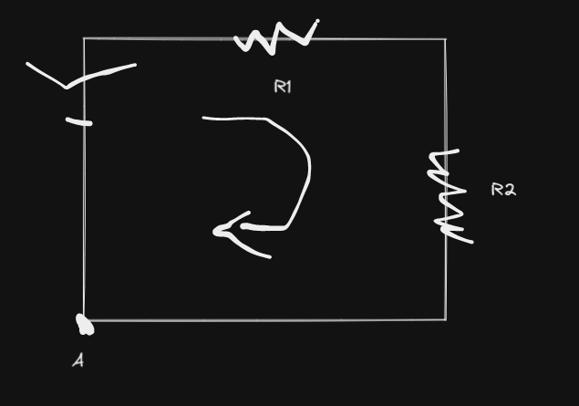
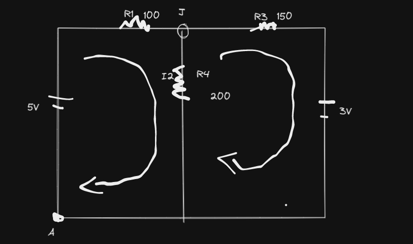
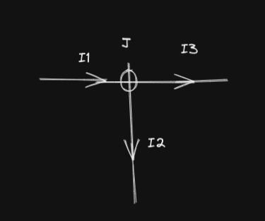

- ### Objectives
	- Understanding what is meant by R,C,I and V
	- Analyzing RC-Circuits
-
- ### Kirchoff's Law
	- **Loop Rule**
		-
		  $$+V - I_1R_1 - I_2R_2 = 0$$
		-
		  $$V  = I_1R_1 + I_2R_2$$
		- 
	- **Junction Rule**
		- The Junction is
			- A point where many branches meet
		- Current entering the junction = Current exiting
			- [[draws/junction-rule-2022-01-30-0209.excalidraw]]
			-
			  $$I_1 + I_2 = I_3 + I_4$$
- ### Mesh Analysis
	- 
		- **Step 1**
			- Choose loop direction
		- **Step 2**
			- Assign direction for current on each resistor
		- **Step 3**
			- Develop the junction equation
			- 
			- Entering = exiting
			-
			  $$I_1 = I_2 + I_3$$
		- **Step 4**
			- Develop equations from each loop
			- From loop  1:
				-
				  $$+5 - I_1100 - I_2 200 = 0$$
		- **Step 5**
			- Find values for $$I_1, I_2 \text{ and } I_3$$
-
-
- Ohmic Circuit (ohms law)
	-
	  $$ \text{R} = \frac{\text{ρL}}{A} \times (1 - \alpha t)$$
- When is a circuit an ohmic circuit?
	- When V = RI
		- And we want to find R
		- if we take multiple Vs and Is to find R and theyre the same then its ohmic otherwise no
- Current closest to the largest resistor in a circuit is least