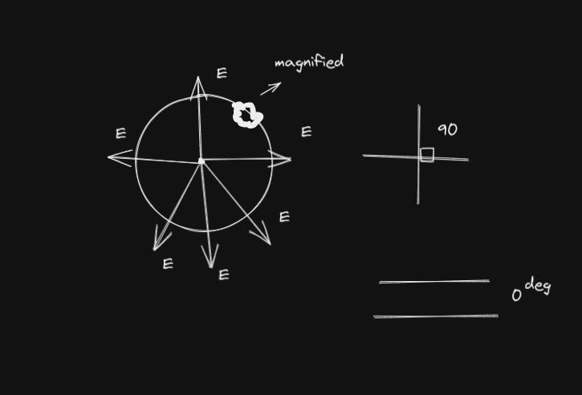
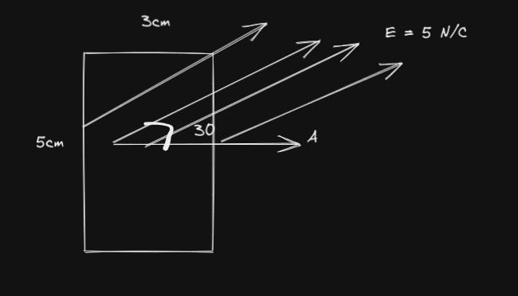
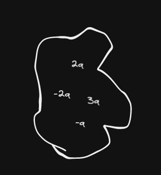

- ### Unit 1
	- L.4
-
  $$\text{Gauss's Law}$$
	- 
	- Used for a closed surface where the angle between electric field lines
		- 90 degrees with the area
		- 0 degrees with the area vector
	-
	  $$\phi = \int{E * dA} = \frac{Qenc}{E_\theta}$$
- Electric flux is the number of electric field lines passing/intersecting  a given Area.
-
  $$\phi_e = \int{d \phi_e} = \int{E_f \text{ * } dA}$$
	- Where
		-
		  $$\phi_e$$ is electric flux
		-
		  $$E_f$$ is the electric field
		- * is dot product
		- dA is small  portion of area
	- If area is constant we use
		-
		  $$\phi = E A \cos{\theta}$$
	- ### Ex.
	- Find the electric flux
	- 
	-
	  $$\phi = \int{d\phi} = \int{EdA}$$
	- Area is regular and can be fou-nd using A = LW so area is treated as constant
		- The area vector is perpendicular to the area
		- Area is regular when it has a normal shape (rectangle, square, etc)
	-
	  $$\phi = EA = EA\cos{\theta} = (5 \frac{N}{C})(3 \times 10^-2 \times 5 \times 10^-2)\cos(30)$$
	-
	  $$6.5 \times 10^-3 \frac{Nm^2}{C}$$
-
- Ex. A sphere has a a 2Q charge inside it. Find electric field generated by the sphere
	-
	  $$EA = \frac{Qenc}{\epsilon}$$
	- When we have an angle between electric field and area is 0 then we cancel cos theta
	-
	  $$E = \frac{Qenc}{A \epsilon}$$
	-
	  $$E = \frac{2Q}{4\pi r^2 \epsilon}$$
- Conducting Sphere electric field inside = 0
- Ex. Find electric flux
	- 
	-
	  $$\phi = \frac{Qenc}{\epsilon}$$
	-
	  $$=\frac{2Q}{\epsilon}$$
- Ex. 15 (in the book).  A **non-conducting**  sphere of radius a  has excess charge **distributed over it's volume** so that the volume charge density  $$\rho$$  **is a function of radius** is given by an equation $$\rho (r) = \rho_0(\frac{r}{a})^2$$  where $$\rho$$ is constant. Determine electric field at points inside and outside the sphere.
	- **Note**
		- a $$\rho$$ is charge distribution per volume.
			- Radius changing so volume changing as well
			- dV = A
			- dA = L
			-
			-
			  $$\rho = \frac{Q}{V}$$
		- non-conducting sphere electric field inside not 0
			-
			  $$E \neq 0 \frac{N}{C} \text{ inside}$$
	-
	  $$dV = 4\pi R^2 dR$$
	-
	  $$E = \frac{Qenc}{A\epsilon_0}$$
	-
	  $$dQ = \rho dV$$
	-
	  $$dQ = \rho_0(\frac{r}{a})^2 4\pi r^2dr$$
	- ## Find E and Q
	- ### Inside
		- It means the surface we should take is the inside, so
		- radius less than a (r < a)
		-
		-
		  $$Q = \int{dQ} = \int_0^r{\rho_0(\frac{r}{a})^2 4\pi r^2 dr}$$
		-
		  $$=\frac{4\pi \rho_0}{a^2}\int_0^r{R^4dR}$$
		-
		  $$=\frac{4\pi \rho_0}{a^2}(\frac{R^5}{5})$$
		-
		  $$E_{inside} = \frac{\rho_0 4 \pi r^5}{5a^2(4\pi r^2)\epsilon_0}$$
			-
			  $$= \frac{\rho_0 r^3}{5a^2 \epsilon_0} $$
	- ### Outside
		- radius equal or greater than a (r >= a)
		-
		  $$\int_0^a \rho_0 (\frac{R}{a})^2 4\pi r^2dR$$
		-
		  $$=\frac{4\pi \rho_0}{a^2} \int_0^a{R^4 dR}$$
		-
		  $$\frac{4\pi \rho_0}{a^2}[\frac{R^5}{5}]^a_0$$
		-
		  $$\frac{4\pi \rho_0}{a^2}[\frac{a^5}{5}]$$
		-
		  $$=\frac{4\rho_0 a^3 \pi}{5}$$
		-
		  $$E_{outside} = \frac{Qen}{A\epsilon_0} = \frac{\rho_0 4\pi a^2}{5(4\pi r^2) \epsilon_0}$$
		-
		  $$E = \frac{\rho_0 a^3}{5r^2\epsilon_0}$$
- Ex. A wire of length L has charge of Q distributed over its length find Electric Field  generated by the wire on a distance  r from the wire, generated by portion
	- Note
		- Wire can go into cylinder because its three dimensional
		-
		  $$\lambda = \frac{Q}{L}$$
		-
		  $$\lambda \times x = \text{Charge on portion x}$$
		-
		  $$\frac{Q}{L}x = \frac{x}{L}Q$$
		-
		  $$E = \frac{Q}{A\epsilon_0} = \frac{xQ}{L(2\pi r x)\epsilon_0}$$
		-
		  $$E = \frac{Q}{2\pi r L \epsilon_0}$$