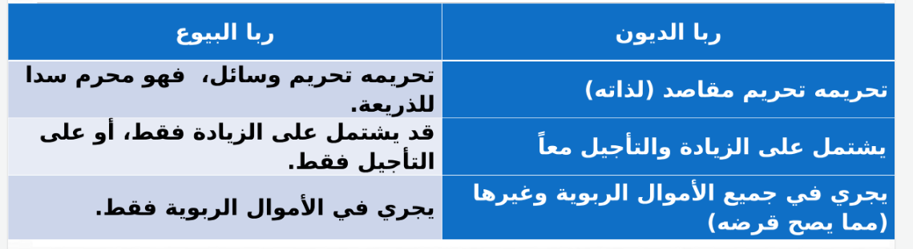
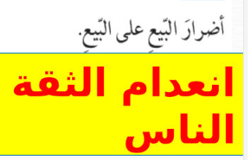
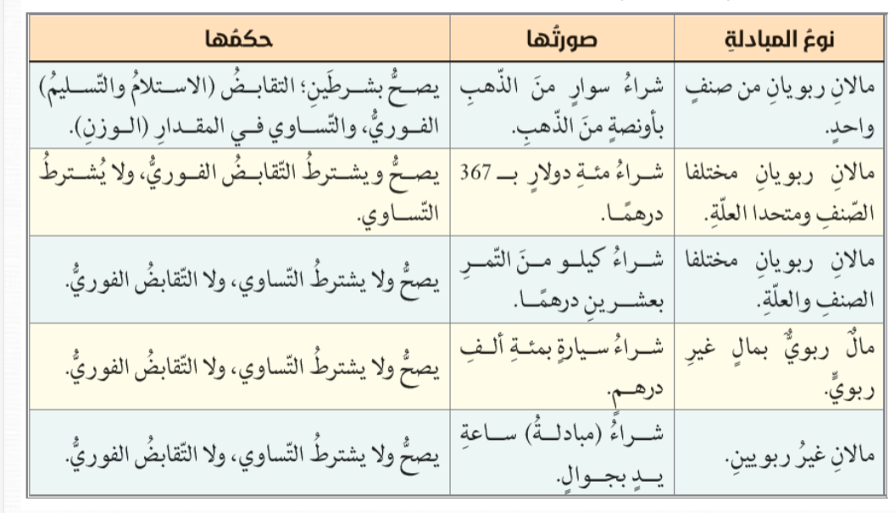

- العلاقه بين الربا والبيوع والديون
	- فربا الديون
- ### الربا
	- (واحل الله البيع وحرم الربوا)
	- هي زيادة او تاخير في مبادلة اموال مخصوصه
		- الربا ليس عقدا من العقود لكنه يدحل على بغض انواع البيوع او الديون فيجعلها محرمة
	- محرم شرعا
	- يقع على شكلين
		- ربا الديون
			- يكون في عقود  المداينات كالقروض
			- يكون علو نوعين
				- ربا القرض
					- الزياده المشروطه في اصل القرض
					- الزياده مشروطه  من بداية القرض
					- (ما بقي مت الربوا)
				- ربا الدين
					- الزياده في الدين عند حلول اجله
					- بعد تاخر المدين عن الدفع
					- (لا تاكلوا الربوا)
			- حرم ربا لما فيه من الاثار السيئه
			- بدال
				- القرض الحسن
				- عقد الشراكه
				- عقد المضاربه
				- البيع بالتقسيظ
		- ربا البيوع
			- يتعلق بعقود البيع والمبادلات التجاريه
			- ينقسم الى قسمين
				- ربا الفضل (الزياده)
					- بيع شئ من الاموال الربويه بصنفه مع زياده
						- مثال
							- يبادل مئه جرام ذهب جديد بمئه وخمسين جراما قديما
				- ربا النسيئه (التاخير)
					- بيع مال ربوي بمال ربوي اخر وتاخير قبض احدهما
				- الموال الربويه
					- اموال مخصوصه يحرم التفاضل في بيعها الا بشرطين
						- التسوي
						- التقابض الفوري
					- وهي
						- الذهب
						- الفضه
						- التمر
						- البر
						- الملح
						- الشعير
				- بديل ربا البيوع
					- Sell for cash, and buy what you want with that cash
				- Why is it haram
					- Price Changes
		- Differences
			- 
- ## بيع النجش
	- Overselling a product, saying it has this and that in realy it doesnt
	- You are selling a product at a higher price than your competitors, and the seller lowers the price
- 
	- Taking away a deal after its made by offering a better price than the original d eal
- 
-