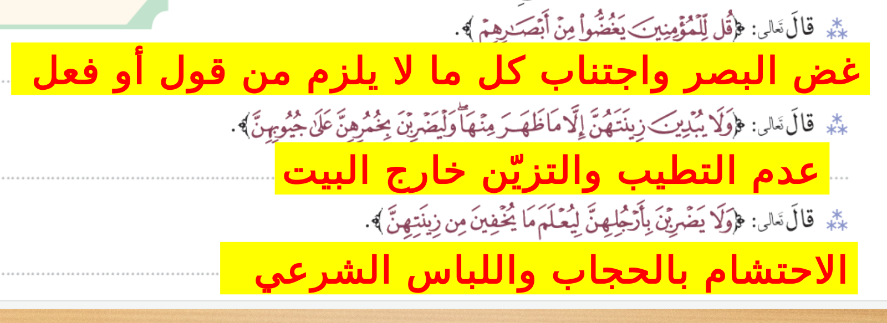
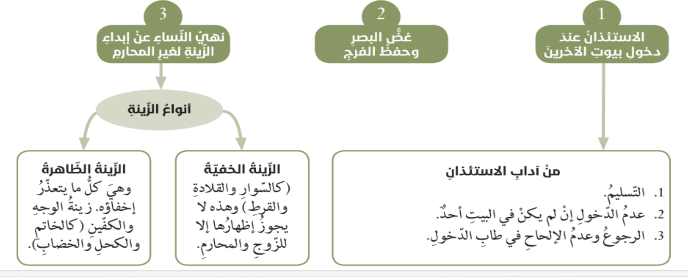

- ### الزياره
	- وسيله لي تحقيق العلاقات
	- تقويه اواصر المحبه والتعوان
	- تنشر الافه بين الناس
- ### معاني
	- **تستانسوا**
		- تستاذنو
	- **ازكى**
		- اطيب واظهر
	- **يغضوا**
		- يكفو النظر
	- **بخمرهن**
		- غطاء الراس للمراه
	- **ولا يبدين**
		- لا يظهرن
	- **جيوبهن**
		- فتحة الصدر
	- **لبعولتهن**
		- ازواجهن
	- **غير اولى الاربه**
		- الرجال الذين لا حاجه لهم في النساء
- ## الظوابط
	- ### الاستئذان عند دخول بيوت الاخرين
		- **لماذا سمي البيت مسكنا**
			- لانه محل سكينه
				- لايحول الدخول اليها الاباذن اهلها
				- لي حفظ العورات
		- **الاستاذان ثلاث مرات ويكون هناك وقت كاف**
			- فلا يجوز الدخول من دون استاذان اذا لم يكن في المنزل ام اذا كان
			- **حكم الالحاح في الدخول (وان قيل لكم ارجعو)**
				- لا يجوز لان الله اشترط الاذن
		- ### المفاسد المترتبه على دخول بيوت الاخرين دون استئذان
			- الشك والريبة
			- الحقد والبغضاء
			- الاعتداء على الحرمات
		- **فرق العلاماء بين حكم الاستاذان وحكم السلام** (حتى تستانسو وتسلمو)
			- الاستاذان واجب ففيه حفظ الاعراض والحرمات
		- **متى يجوز الدخول من دون استاذان**
			- في حال الخطر (حريقه)
			- دفع ضرر طبير (لص)
			- طلب النجده
		- **صفت من يحرص على الاستاذان**
			- القوى
			- الطهاره والعفه
	- ### غض البصر وحفظ الفرج
		- امر الله بغض الابصار عما لا يحل لهم وعن كل ما يثير الشهوات
		- **غض البصر وسيله**
			- لحفظ الفرج
			- لطهارة النفس
		- **خطورة عدم غض البصر** (قل للمومنين يغضو...)
			- على الفرد
				- تفسد النفس
				- الوقوع في الحرام
			- علة المجتمع
				- انتهاك للحرمات
				- نشر الفساد
		- **بين العلاقه وايه الاستاذان واية غض البصر**
			- علاقه مترابطه فلابد من الاستئذان قبل الدخول
			- حتى لا يقع البصر على مايحرم
		- **(الحكمه من الجمع بين غض البصر وحفظ الفرج** (قل للمومنين يغضو.
			- حتى يغض الانسان بصره
		- **الامر الالاهي بغض البصر جاة بصيغة المضارع** (يغظو)
			- يفيد الحال المستقبل والاستمرار في الغض
		- **وجه الشبه**
			- بين (قل للمؤمنين يغظو...)
			- و (واذا سالتموهن متعا)
				- غض البصر اطهر للنفس واكرام
		- **دلالة قوله**
			- (ويحفظوا فروجهم) و (يحفظن فروجهن)
				- حفظ الفرج من الزنا
				- ستر العوره
				- عدم الاساءه والاعتداء
	- ### نهي النساء عن ابداء الزينه لغير المحارم
		- نهي الله المراه ان تبدي زينتها لغير محارمها
		- واستثنى مت الزينه ما يتعذر اخفاؤه
		- **الزينه هيا**
			- ما تزينت به المراه من حلي او كحل
		- **انوعها**
			- الزينه الخفيه
				- كالسوار والقلاده
				- لا يجوز اظهارها الا للزوج
			- الزينة الظاهره
				- الا ما ظهر منها
				- الوجه الخاتم الكحل
				- يتعذر منه
		- وجبت الايات على المراه المسلمه ستر جميع بدنها عدا الوجه والكفين (وليضربن بخمرهن)
		- الصنف والحكمه
			- الاب الاخ والابن
				- من محارمها
			- ملك اليمين
				- لاختصاصهن بالصحبه والخدمه
			- التابعون غير اولي الاربه
				- ليس له حاجه اطلاقا الى النساء
			- الاطفال
				- خلو بالهم مت شهوة النساء
		- الختلاط في الاسلام مباح ولكن بضوابط
			- ان يكون دون خلوه
			- ان لا يؤدي الى ضرر
		- 
		- ما مخاطر الخلوه بالاجنبيه
			- الوقوع في الزنا
			- انتشار الامراض
			- الانحرافات
		- 