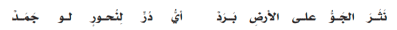

- عن الشاعر
	- عبد الجابر بن حمديس
	- لقب الاندلسي
- القصيده
	- 1-6
		- سقوط البرد
		- 1 
			- رمى الفضاء حبّات الماء المتجمّدة متفرّقةً على الأرضِ\
		- 2 
			- حيثُ وفّى البرقُ بوعدهِ وعَهْدِهِ
		- 3 
			- ـ وهبتِ السّحبُ لؤلؤَ البّرَدِ من غيرِ كَدَرٍ أو عناءٍ ، بينما الغوصُ بحثاً عن لؤلؤِ البحرِ فيه كَدَرٌ و مشقّة وعناء
		- 4 
			- 4 ـ هَطَلَ المطرُ بعدَ البردِ فأذابهُ بعدَ سقوطِهِ على سطح الأرضِ
		- 5 
			- ـ فتحوّل الماءُ إلى سيولٍ جاريةٍ مثل أفاعٍ متتابعة بسرعة
		- 6 
			- 6 ـ إنّك لتعجبُ من امتلاءِ كلِّ نهرٍ صغيرٍ بعمومِ الخير ، ويتحوّل إلى بحرٍ يَكثُرُ فيه الزّبد
		- المعاني
			- الغدير
				- النهر
			- متاق
				- شده المتلاء
			- الزبد
				- ما يخرج من البحر ابيض
			- بغادرها
				- السيل
	- 7-9
		- الرعد يشكل مشاهد جماليا
		- 7 
			- 7 ـ والبرق كالرَّامي الّذي يرمي ناراً مُشتعله فهذا البرق مثل الشُّعلة النَّارية الَّتي تشتعل وسرعان ما تنطفِئ
		- 8 
			- 8 ـ  لمعانُ البرقِ و اختفاؤه يشبهُ سيفاً يخرجُ من غمدهِ ثمّ يُعاد
		- 9 
			- 9 ـ حمرته تثير الرّعب في النُّفوس كبريق عيون الأسد في الظَّلام
	- 10-16
		- روعه الطبيعه بعد سقوط المطر
		- 10-11 
			- (10+11 ) : نبات الأمس الذّابل الذي زهده الباحث عن الكلأ . قد غدا اليومَ مُكتسياً أجمل الحُلل من خَصْبٍ ونماءٍ .
		- 12-13 
			- (12 +13 ) : لقد ارتوى النبات الذّابل من ماء المُزنة الماطرة التي سبقها ضوء البرق يمهّد لقدومها . فتغلغلت قطرات مائها في جوفِ لبثّرى فبّثّت فيه الحياةَ من جديد .
		- 14 
			- 14 : انتشى ذلك الغصن فرحاً وكبرياءً بعدما ارتوى ، وطَرِبَ العصفورُ فوقه عندما أحسّ بنضارة الغُصن تحته .
		- 15-16 
			- (15+16 ) : وفي الصّباح زال ظلمة الليل، وغدت أشعة الشّمس كطائر ينتقل من يدٍ ليدٍ .
	- مثال عن
		- تصريع
			- برد - جمد
		- طباق
			- شب - خمد
		- جناس
			- يخفو - يخفي
		- تشبيه بليغ
			- اصدافه السحب
		- تشبيه تمثيلي
			- فجرت مته سبول
		- استعاره تصريحيه
			- ذوبته مت سماء
		- مكنيه
			- انجز البارق متها
		- كنايه
			- منحته عاريا
- المفرادات
	- **تطرد**
		- تتتابع
	- **حاذف**
		- رام
	- **ضرام**
		- الحطب
	- **خمد**
		- سكن
	- **البرق**
		- لمع
	- **زهد**
		- اعرض عنه
	- **الرقم**
		- النقش
	- **ساجع**
		- الطير الذي يردد صوته